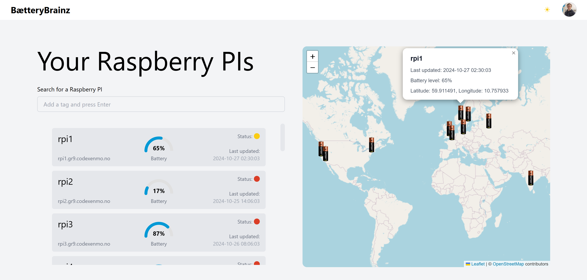
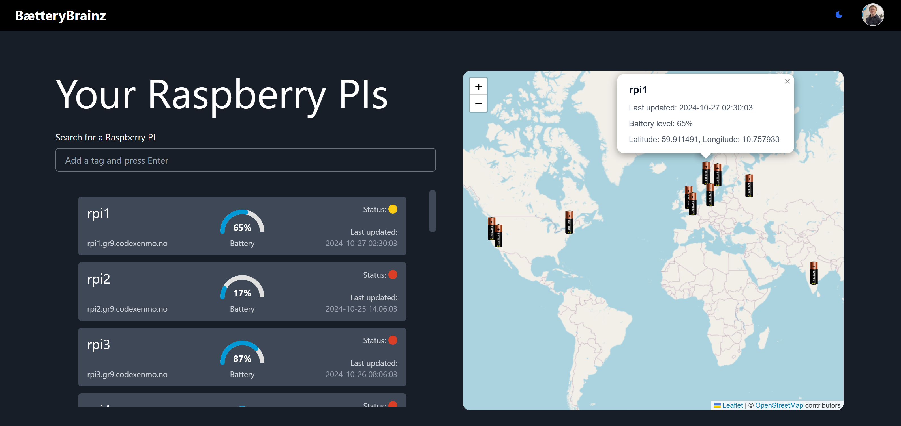
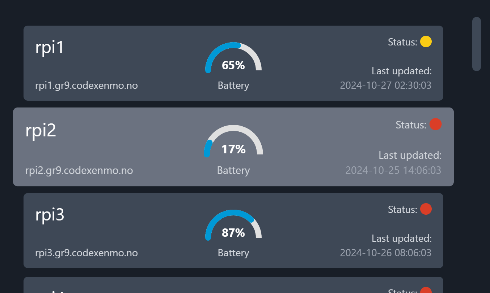
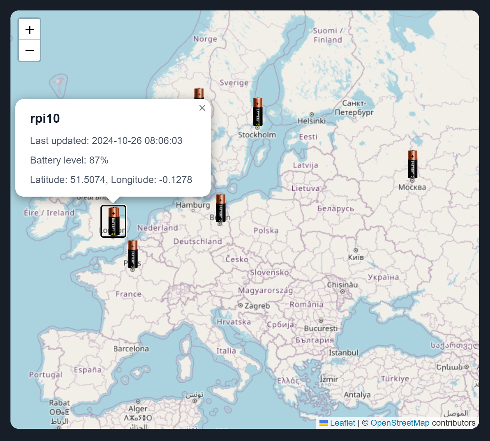

# BætteryBrainz Dashboard

Welcome to **BætteryBrainz**, a dashboard application designed to manage and monitor Raspberry Pi devices. Users can log in using their Google accounts to access a secure dashboard displaying device status, locations, and battery levels.

## Table of Contents
- [Features](#features)
- [Tech Stack](#tech-stack)
- [Setup and Installation](#setup-and-installation)
- [Google OAuth Setup](#google-oauth-setup)
- [Folder Structure](#folder-structure)
- [Available Scripts](#available-scripts)
- [Components](#components)
- [Usage](#usage)
- [Screenshots](#screenshots)
- [License](#license)

## Features

- **Google Authentication**: Secure login via Google OAuth.
- **Device Monitoring**: View the status, last update, and battery level of each Raspberry Pi.
- **Geolocation Map**: Interactive map showing the locations of connected devices.
- **Dark Mode**: Toggle dark and light themes.
- **Responsive Design**: Optimized for both desktop and mobile devices.

## Tech Stack

- **Frontend**: React, TypeScript, Tailwind CSS, Leaflet (for map integration)
- **Backend**: Google OAuth API for authentication
- **Other Libraries**: `@react-oauth/google`, `react-router-dom`, `axios`

## System architecture


## Setup and Installation

### 1. Clone the repository

```bash
git clone https://github.com/yourusername/baetterybrainz-dashboard.git
cd baetterybrainz-dashboard
```

### 2. Install dependencies
```bash
npm install
```

### 3. Set up Environment Variables
Create a `.env` file in the root directory with the following variables:

```plaintext
GOOGLE_CLIENT_ID=your_google_client_id_here
```

Replace `your_google_client_id_here` with your Google Client ID, which you can get from the Google Developer Console.

### 4. Run the Application
```bash
npm start
```

This will start the application on http://localhost:3000.

## Google OAuth Setup
- Go to the Google Developer Console.
- Create a new project or select an existing one.
- Set up OAuth consent screen (under APIs & Services > OAuth consent screen).
- Create OAuth credentials:
- Select Credentials > Create Credentials > OAuth client ID.
- Choose Web Application.
- Set the Authorized redirect URIs to http://localhost:3000 for development or your production URL. If deploying to production, add your production URIs.
- Copy the Client ID and add it to your `.env` file as 
```bash
REACT_APP_GOOGLE_CLIENT_ID.
```

## Folder Structure
```plaintext
.
├── src
│   ├── assets                # Static files like images, icons, and fonts
│   ├── components            # Reusable components such as Navbar, ThemeToggle, and ProtectedRoute
│   ├── contexts              # React Context providers, e.g., UserContext for managing authentication state
│   ├── data                  # Mock data files used for development and testing
│   ├── hooks                 # Custom React hooks for reusable logic
│   ├── pages                 # Main pages of the app (LoginPage, Dashboard, NotFound, etc.)
│   ├── services              # API service files, e.g., for handling Google authentication and other external requests
│   ├── types                 # TypeScript type definitions and interfaces used throughout the app
│   ├── utils                 # Utility functions and helper code for common tasks
│   ├── App.tsx               # Main App component where routes are defined
│   ├── index.tsx             # Application entry point, rendering the App component
│   ├── App.css               # Global styles
│   └── index.css             # Tailwind and custom CSS configurations
├── public
│   ├── readme_images         # Images for the root readme file of this project
│   ├── login.webp            # Background image for the login page
│   ├── favicon.ico           # Favicon for the app
│   ├── index.html            # HTML template for the app
│   └── manifest.json         # Web app manifest for PWA configurations
│   
└── README.md                 # Project README file, detailing setup, usage, and other documentation
```

## Available Scripts
In the project directory, you can run:

- `npm start` - Runs the app in development mode at `http://localhost:3000`.
- `npm run build` - Builds the app for production in the `build` folder.
- `npm test` - Runs tests.
- `npm run format` - Formats code using Prettier and ESLint.

## Components
### 1. LoginPage
- Google login button using `@react-oauth/google`.
- Redirects authenticated users to the dashboard.
### 2. Dashboard
- Displays Raspberry Pi devices with information like status, battery level, and location.
- Uses react-leaflet for the map and custom markers.
### 3. ProtectedRoute
- Wraps protected routes, allowing access only to authenticated users.
- Redirects unauthenticated users to the login page.
### 4. UserContext
- Manages the user’s profile information and authentication status.
- Fetches and stores user data from Google OAuth on page load.
### 5. Navbar
- Displays user profile with dropdown for logout.
- Contains theme toggle for dark mode.
### 6. ThemeToggle
-  Switches between light and dark mode for the app.

## Usage
1. Login: Click on "Sign in with Google" to authenticate.
2. Dashboard: Once logged in, view your devices with relevant status and battery details.
3. Map: Visualize all devices on a map with custom battery icons for each Raspberry Pi.
4. Theme Toggle: Use the theme toggle to switch between light and dark modes.
5. Logout: Access the logout button in the profile dropdown in the navbar.
## Screenshots
(Add screenshots of your application here to illustrate the UI and features)

### Login Page


### Dashboard - Light mode


### Dashboard - Dark mode


### Hover Raspberry PI unit


### Map with Device Markers


## License
This project is licensed under the MIT License. See the [LICENSE](LICENSE) file for details.